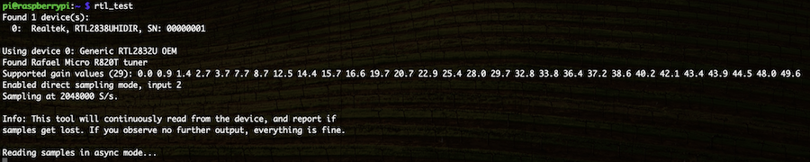
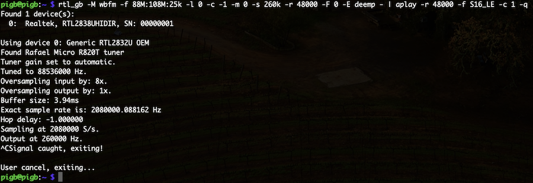
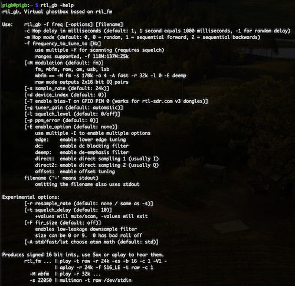
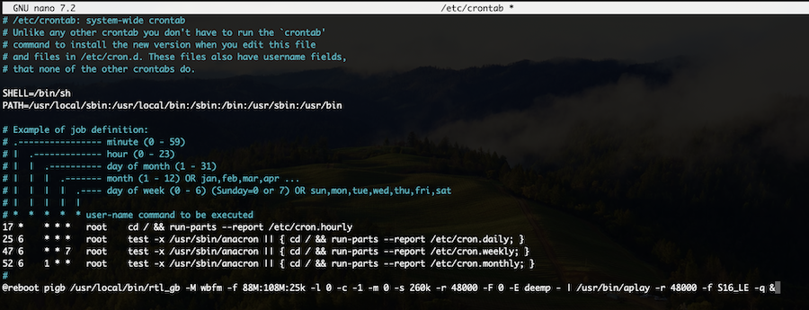

# Simple Install

This documentation is a work in progress. It expects some knowledge of Linux and Raspberry Pi setup. It may not be the best way. Be careful of word wrap.

This is a very basic install. It's enough to get Raspberry PI OS installed and updated and install the rtl-sdr-blog drivers along with the custom rtl_gb application. The rtl_gb process gets started automatically via /etc/crontab and outputs audio via the onboard audio jack. 

The Full install walks through installing hostapd, dhcpd and other tools to allow you to control the ghostbox when walking around with it. 

The SDR dongle needs to support, and should be plugged into, a USB3 (blue) port. The black USB ports are USB2 and could lead to drops due to the slower speed. You can likely sample less bandwidth to still get it to work, but if you're using a Pi 4 and you have a USB3 SDR stick, there's no reason to plug it into a USB2 port. 

## Install Raspberry Pi OS 64bit

There's plenty of documentation out there on setting this up, so this is only the basics.

* Download Raspberry Pi Image Tool - https://www.raspberrypi.com/software/

1) Plug empty SD card into computer
2) Download and Run the Image Tool
3) Click Choose Device and select the Pi model you'll be installing on. For me, I chose Raspberry Pi 4.
4) Click Choose OS, click on Raspberry Pi OS (other) and then select Raspberry Pi OS Lite (64-bit). Make sure you're choosing the 64 bit version. There really is no need for the full desktop environment on here, but if you want to install the full 64 bit OS you can do that as well. My documentation is based off installing Lite 64 bit.
5) Click Choose Storage and choose the blank SD card you have plugged into your computer
6) Click Next and then click EDIT SETTINGS. 
   * On the General tab, put a check in set username and password, enter **pigb** as the username and whatever password you want. You can configure wireless and the hostname on this tab also.
    
     **NOTE: The password you set must match the minimum security requirements for the OS. If you are not able to login via SSH, and you are sure you are using the correct username and password, you will have to go through the process to write the OS to card again, using a better password. Make sure it's at least 8 characters, has an upper case letter, a lower case letter, a number and puctuation**
    
   * On the Services tab, put a check in Enable SSH
   * On the Options tab, you may or may not want to disable telemetry
   * Click Save
7) Back on the Use OS Customization window, click YES and then click that you want to continue and off you go.

8) Once the Imager is done, pop the card in your Pi and boot it up. Be patient, it may take a minute or two to finish booting the first time. I takes a little time for the initial customization to apply (the setings from #6 above).

## Logging in to the Pi

Since wifi will be used to present an access point for your mobile device to connect to in the Full version, plug the Pi in via ethernet cable for install. You can configure wireless and log in that way, but you're going to have a conflict when you configure the access point so the Pi will be a wireless access point for you to connect to. My instructions below assume you are installing via a wired network connection. It's totally possible to install and configure by connecting over wireless, but at some point you will need to reboot with wireless client shut off and access point turned on.

At some point, regardless of whether you used wireless or wired, you will need to check your router, firewall or whatever else acts as your DHCP server to find what IP the Pi is on. Then SSH in using the username and password you configured in the imager.

If you're plugging in a monitor and keyboard, you can login that way and once in use the **ip a** command to find the IP. If you have an ethernet cable plugged in, it'll be the IP for eth0.

## Apply Latest OS Updates and Reboot

     sudo apt update
     sudo apt upgrade -y
     sudo rpi-update

Once updates are complete, reboot with

     sudo reboot

If you skip rpi-update, you'll have issues like being able to run rtl_fm once, but after hitting control-c you can't run it again, usually getting a **rtlsdr_write_reg failed with -7** error. You most likely do not need to run rpi-update again after this.

## Install RTL-SDR-BLOG drivers and RTL_GB

Most of this comes from https://www.rtl-sdr.com/rtl-sdr-quick-start-guide/ (search for Linux)

1) Login to your pi as the pigb user
2) Purge any existing drivers:

     ```
     sudo apt purge ^librtlsdr
     sudo rm -rvf /usr/lib/librtlsdr* /usr/include/rtl-sdr* /usr/local/lib/librtlsdr* /usr/local/include/rtl-sdr* /usr/local/include/rtl_* /usr/local/bin/rtl_*
     ```
     
4) Run the commands below to install software we're going to need, and compile and install the rtlsdr library and tools. The commands are split apart below so you can copy and paste each block into your SSH session.

     ```
     sudo apt install -y libusb-1.0-0-dev git cmake wget ffmpeg sox
     ```

     ```
     git clone https://github.com/rtlsdrblog/rtl-sdr-blog
     ```

     ```
     cd rtl-sdr-blog/src
     wget --no-check-certificate --content-disposition https://raw.githubusercontent.com/inc0gnitus/PiGB/main/rtl_gb/rtl_gb.c -O rtl_gb.c
     wget --no-check-certificate --content-disposition https://raw.githubusercontent.com/inc0gnitus/PiGB/main/rtl_gb/rtl_gb.patch -O rtl_gb.patch
     patch < rtl_gb.patch
     cd ..
     mkdir build
     cd build
     cmake ../ -DINSTALL_UDEV_RULES=ON
     make
     ```

     You can safely ignore any warnings that pop up while it's compiling.

     ```
     sudo make install
     sudo cp ../rtl-sdr.rules /etc/udev/rules.d/
     sudo ldconfig
     echo 'blacklist rtl8xxxu' | sudo tee --append /etc/modprobe.d/blacklist-rtl8xxxu.conf
     echo 'blacklist dvb_usb_rtl28xxu' | sudo tee --append /etc/modprobe.d/no-rtl.conf
     echo 'blacklist rtl2832' | sudo tee --append /etc/modprobe.d/no-rtl.conf
     echo 'blacklist rtl2830' | sudo tee --append /etc/modprobe.d/no-rtl.conf
     ```
     
6) Plug in SDR and reboot with

     ```
     sudo reboot
     ```

## Testing the SDR and rtl_gb

Login to your pi as the pigb user. Run rtl_test

     rtl_test -p
     
It will run in PPM error measurement mode until you hit control-c. For our purposes, PPM isn't important, but if you are interested in what the PPM is for your dongle, let this run for ~60 seconds before hitting control-c.

You should see something like the following:



The Nano SDR eventually gets down to 0 cumulative PPM anyways and usually doesn't require messing with PPM offsets. Sometimes you might see 1 or 2 **lost at least # bytes** message right after you start rtl_test (or any rtl_* application really). That seems to be "normal", but you shouldn't see any more. 

If it doesn't work, look in /var/log/messages, /var/log/daemon.log and /var/log/syslog for clues as to what is wrong.

Hit control-c and plug earbuds into the audio jack on the pi, and try rtl_gb with the following command. You should hear static and channel hopping on your earbuds.

     /usr/local/bin/rtl_gb -M wbfm -f 88M:108M:25k -l 0 -c -1 -m 0 -s 260k -r 48000 -F 0 -E deemp - | aplay -r 48000 -f S16_LE -q

You should see output like this. Hit control-c to stop it.



Type **rtl_gb -help** for the help screen. It's essentially the same as rtl_fm, except that you can set squelch to 0, and set hop delay (-c) and hop mode (-m).



## Running rtl_gb on boot

You can skip this part if you're going to do the full install.

If all you're interested in is having the ghostbox run automatically and output to the audio jack, you are ready to go. You could add the following (or similar) to /etc/crontab to start the ghostbox on boot.

1) Edit /etc/crontab with vi (or nano)

     ```
     sudo vi /etc/crontab
     ```
     or
     ```
     sudo nano /etc/crontab
     ```
   
3) At the end of the file, add a line like the following:

     ```
     @reboot pigb /usr/local/bin/rtl_gb -M wbfm -f 88M:108M:25k -l 0 -c -1 -m 0 -s 260k -r 48000 -F 0 -E deemp - | /usr/bin/aplay -r 48000 -f S16_LE -q &
     ```

Your file should look like the following screenshot.




The above is a single line, so be careful of any word wrap. Now when you reboot, rtl_gb will auto start. 

This command uses a random hop delay and random frequencies, between 88Mhz and 108Mhz, which is broadcast FM in the US. Things you might change in here are the frequencies listed in -f, the delay in -c (200 is pretty good) and the mode (0 random frequency, 1 sequential forward, 2 sequential backwards). 

## Shutting down and next steps

To shut it down, unplug power from the Pi. It's not very elegant, and there's very little control over anything, but it'll get you up and running quickly. To change the settings (change hop mode or delay, etc), you would need to plug the Pi back into network, SSH in and change the command in /etc/crontab.  

If you want more control, take a look at [Full Install](INSTALL-Full.md).
