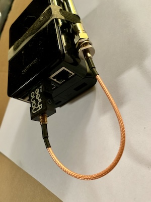
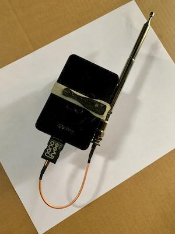

# PiGB
Raspberry Pi GhostBox

_The first ghost box was created by Frank Sumption, who died in 2014, and was really made to talk to aliens._

Started in 2021, this was my attempt to create a Raspberry Pi based ghostbox using a RTLSDR dongle. I had a few requirements in mind:

* Small enough to carry around comfortably
* Completely self contained
* Output optiopns: Icecast, save to WAV, direct bluetooth (not recommended)
* Easy to use web interface to control it using the Pi's onboard wifi as an AP
* Easy way to apply SoX and FFMPEG filters to output (ex, filter out some static)

# Potential issues/Gotchas

## Beware Hot Dongles!

The SDR dongles get very hot. You need to hold everything in such a way that you don't accidentally touch the metal casing on the SDR. It is normal, and expected, for the dongles to get hot. This is why I don't currently have an enclosure for everything, because I don't want to cause any sort of overheating. **Be Careful - Don't Burn Yourself**

## No AM currently 

Also, this currently only does FM, although in reality it can hop whatever the dongle supports. The linked dongle, which is a Nano, covers frequency range 25MHz - 1750MHz (but of course, the antenna matters, depending on what range). I typically use FM range and modulation, 88Mhz-108Mhz. Supporting AM is possible I imagine, but will require carrying around an upconverter (there is a nano version: [HamItUp Nano](https://www.amazon.com/Ham-Up-Nano-Upconverter-Accessories/dp/B084KL1MXM)) and the approprate antenna. For my purposes, normal FM range or even a range that should have just static (varies by location) works well.

## No Case

Right now I use the Pi4 case that came with the Canakit linked below, with the Nano SDR plugged into one of the USB ports and the antenna and battery attached with some velcro. The SDR is designed to get hot as it's used, so I am not sure how that can be put into a case that's easy to carry. It basically fits in the palm of my hand as it is now, but I've also considered adding some sensors (temp, etc), and there's no place to mount them currently. Here's a couple links showing how mine is put together. I like this because it goes in the palm of my hand and my hand can touch the antenna and still keep away from the hot SDR case.

# Parts Used

* Raspberry Pi 4 - [Amazon.com](https://www.amazon.com/CanaKit-Raspberry-8GB-Starter-Kit/dp/B08956GVXN)
* Battery - At least 10,000mAh, also purchase the correct plug (pi 4 is USB-C, the 3 isn't) - [Amazon.com](https://www.amazon.com/gp/product/B0194WDVHI)
* Antenna - [Amazon.com](https://www.amazon.com/gp/product/B07PT76LW4)
* SDR - I used a NooELEC Nano - [Amazon.com](https://www.amazon.com/gp/product/B07XPZMDZV)
* Cable to go from SDR to antenna - [Amazon.com](https://www.amazon.com/gp/product/B00CTJN480)
* SD card (if you don't buy the kit, the bigger the card, the more recordings you can make)
  
# How I Use It

YMMV, but for me when I reach a location I want to use the PiGB in, I plug in the battery and give it a minute to boot. Then on my phone, there will be a wireless network called PiGB4. Once joined, you can pull up the web interface to control the ghostbox. Typically I use "Stream to Icecast", which allows me to use VLC on my phone to play the audio stream and from there I can pair a bluetooth speaker or earbuds to my phone if I want privacy. I usually just use the phone speaker. Icecast is a nice option because multiple people can connect to the Pi's wifi AP and then stream from Icecast on their own device (with their own speaker/earbuds). 

Originally I wanted to pair bluetooth devices directly to the Pi. I'll include instructions, but please note I found it extremely unreliable and fiddly. When it doesn't work, it can be a frustrating half hour or more to get it working again. I've found it's better to use Icecast, stream to your phone and have your bluetooth device paired to your phone instead. The last thing you want to do is fiddle with the Pi's bluetooth abomination while in a good location to run a ghostbox. Nothing ruins the mood more then "technical difficulties". Bluetooth also takes more power and wears the Pi's battery down more. 

While walking through the woods, typically my wife will actually carry the Pi and I'll control/output on my phone. I've noticed I can get a good 20 feet away and not lose the wireless connection. The battery linked above has been used many times, and typically an hour long session doesn't even take 25% of the battery. I've never gone long enough to wipe out the battery. 
