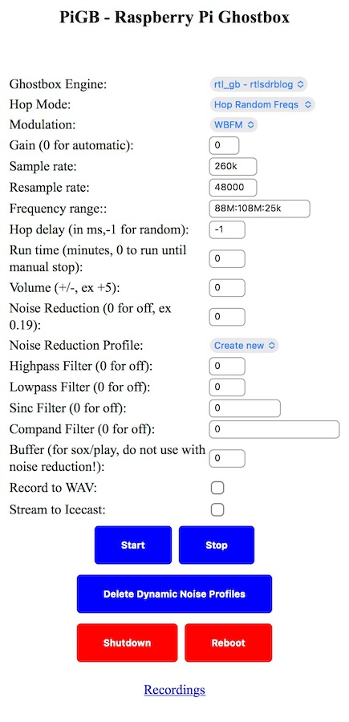
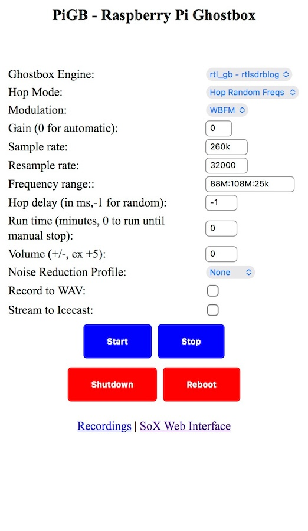

# Using the ghostbox

## Simple install

There's no real control involved. To change frequency range, hop mode or hop delay, you would need to SSH to the Pi and edit /etc/crontab. This is just to get you up and running as quickly as possible. 

## Full install

The full install gives you many more options, such as a web interface and a streaming audio server that multiple people can connect to.

### IPs and URLs and Such

**Raspberry Pi Wireless:** 10.42.0.1. Once connected to that wireless AP, your device will be given a 10.42.0.x IP.

**Wireless SSID:** PiGB 

**Web Interface (using SoX):** http://pigb.local/gb

**Web Interface (using FFMPEG):** http://pigb.local/gb/index-ffmpeg.php

**Icecast web:** http://pigb.local:8000

**Icecast Stream URL:** http://pigb.local:8000/gb

### SoX Web interface

The default interface pipes audio through sox, which is a swiss army knife for audio processing. For our purposes, it allows us to use filters link sinc, compand, highpass and lowpass, and play around with noise reduction.

* Ghostbox Engine: There is only one right now, based off of rtlsdrblog's version of rtl_fm
* Hop Mode: Hop random frequencies, hop sequential forward, hop sequential reverse (I personally like random the most)
* Modulation: WBFM (wideband FM), FM or AM. Default is WBFM.
* Gain: RF Gain, 0 for auto. When you run **rtl_test**, it will output the supported gain values. The Nano 3 can go up to 49.6. More gain, more noise.
* Sample Rate: Defaults to 260k, the number of samples taken from the radio dongle per second. Probably can be lower.
* Resample Rate: Resample at 48k. This can probably be lower also.
* Frequency Range: Defines the range of frequencies to hop in format START:END:STEP. For 88M:108M:25k, it's hopping frequencies between 88Mhz and 108Mhz (US FM), in intervals of 25khz. The step size only matters if you're using a sequential hop mode.
* Hop Delay: How long to wait before hopping to next frequency. Use -1 for a random hop delay, which I personally like. I say it's in ms, but I don't know that it's actually that granular. Something to work on in the future.
* Run time: How many minutes to run rtl_gb before automatically stopping. Kinda neat if you have a set time, and you want to have the output go to a WAV file. Setting it to 0 runs until you stop it or power the Pi off.
* Volume, highpass, lowpass, sinc and compand filters - Refer to https://sox.sourceforge.net/sox.html for details. Setting volume to +5 or +10 is sometimes useful.
* Noise Reduction and Noise Reduction Profile - Sox is able to do some noise reduction. It does this by creating a noise profile based on whatever audio data it was fed. This is mostly for fun, you can get some weird effects. For the Noise Reduction value, sometimes as little as a value of 0.1 is enough. It's one of those things you can just play with. I provide a few (pink noise, brown noise, and whitenoise at 32k and 48k), but it can also create a new one. Change the value to something other then 0, and in the Noise Reduction Profile dropdown choose Create New. When you tap Start, it will create a noise profile based on the radio settings on this page, and then apply that to live output. I'm not sure how much real value there is, but it's fun to play with.
* Buffer: tell sox and play to use a buffer by specifying a size here in bytes. This does not work with noise reduction
* Record to WAV: Records output from rtl_gb to a WAV file. Those files can be downloaded by tapping on the Recordings link at the bottom of the web page.
* Stream to Icecast: Streams to the local Icecast server. You can use Record to WAV and Stream to Icecast at the same time, or independent of each other. If neither are specified, audio will play out of the onboard audio jack. 

### FFMPEG Web Interface

There's not many options on the FFMPEG web interface yet.

The options mean the same thing. The main difference is the noise reduction. This uses FFMPEG's arnndn filter which uses Recurrent Neural Networks to filter out noise. I've had decent luck with it. 

## Icecast

The web interface for Icecast will be available at **http://pigb.local:8000** once you are connected to the PiGB network. When you are actively streaming, this page will list the /gb stream. There's not much need to connect to the admin web page, but just be aware it's there. To login as admin, the username is _admin_ and the password is what you set in icecast.xml.

There's probably lots of ways of streaming this, but I personally use VLC on my iphone. Once you start the ghostbox by hitting Start on the web page, if you've selected Stream to Icecast, switch to VLC on your phone. Tap Open Network Stream and in the box at the top enter **http://pigb.local:8000/gb** and tap Open Network Stream. You can switch back to your web browser, tap Stop, change settings, tap Start and switch back to VLC and reconnect to test different audio settings.

What I like about this is multiple people can connect to the **PiGB** wireless and stream audio to their own device. 
